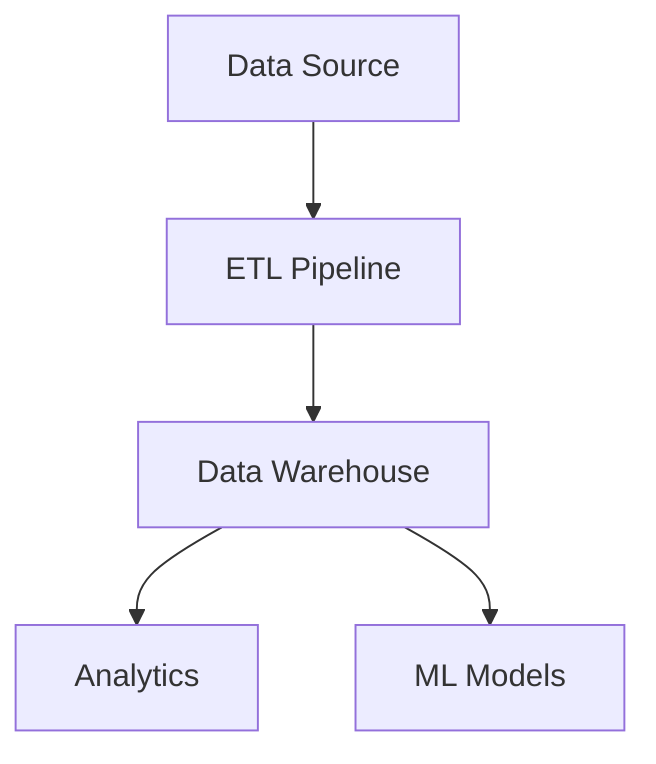
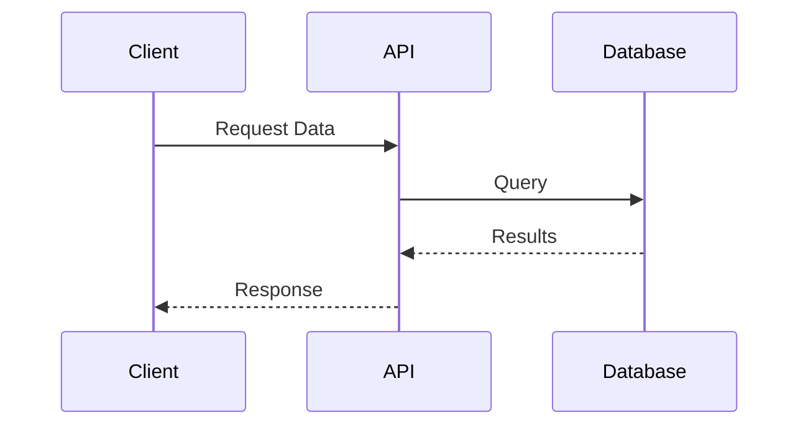
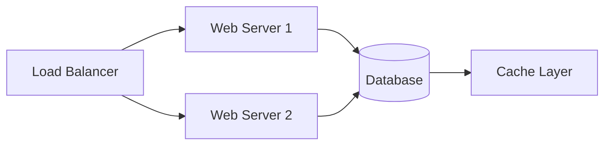

# Charles Kubicek - Blog

A blog built with Hugo and the PaperMod theme.

## Prerequisites

- **Hugo Extended** (v0.112.0 or later)
  ```bash
  brew install hugo
  ```
- **Git** (for version control and deployment)

## Setup Instructions

### 1. Configure GitHub Repository

Before deploying, you need to:

1. Create a new GitHub repository for your blog
2. Update the `baseURL` in `hugo.toml`:
   ```toml
   baseURL = "https://<USERNAME>.github.io/<REPO>/"
   ```
   Replace `<USERNAME>` with your GitHub username and `<REPO>` with your repository name.

3. Enable GitHub Pages in your repository:
   - Go to repository Settings → Pages
   - Under "Source", select "GitHub Actions"

### 2. Connect to GitHub

```bash
git remote add origin https://github.com/<USERNAME>/<REPO>.git
git add .
git commit -m "Initial blog setup"
git push -u origin main
```

## Daily Usage

### Creating a New Post

To create a new blog post:

```bash
hugo new content posts/my-new-post.md
```

This creates a new markdown file in `content/posts/` with front matter. Edit the file and set `draft: false` when ready to publish.

### Local Preview

To preview your blog locally with draft posts included:

```bash
hugo server -D
```

Then open your browser to `http://localhost:1313`

To preview without drafts (production mode):

```bash
hugo server
```

### Publishing to GitHub Pages

Once you're happy with your changes:

```bash
git add .
git commit -m "Add new post about [topic]"
git push origin main
```

The GitHub Actions workflow will automatically build and deploy your site. Check the "Actions" tab in your GitHub repository to monitor the deployment progress.

## Writing Syntax Guide

### Front Matter

Every post should have front matter at the top:

```yaml
---
title: "My Post Title"
date: 2024-12-03T10:00:00-08:00
draft: false
tags: ["AI", "Data Engineering"]
categories: ["Tutorial"]
---
```

### LaTeX Math Equations

**Inline math** - Use single dollar signs:
```markdown
The famous equation is $E=mc^2$.
```

**Display math** - Use double dollar signs:
```markdown
$$
\frac{-b \pm \sqrt{b^2 - 4ac}}{2a}
$$
```

**Example:**
```markdown
The gradient descent update rule is $\theta := \theta - \alpha \nabla J(\theta)$, where:

$$
\nabla J(\theta) = \frac{1}{m} \sum_{i=1}^{m} (h_\theta(x^{(i)}) - y^{(i)}) x^{(i)}
$$
```

### Mermaid Diagrams

Create diagrams using code blocks with the `mermaid` language identifier:

**Flowchart:**
````markdown

````

**Sequence Diagram:**
````markdown

````

**Architecture Diagram:**
````markdown

````

### Code Syntax Highlighting

Use triple backticks with a language identifier:

**Python:**
````markdown
```python
def fibonacci(n):
    if n <= 1:
        return n
    return fibonacci(n-1) + fibonacci(n-2)
```
````

**JavaScript:**
````markdown
```javascript
const fetchData = async () => {
    const response = await fetch('/api/data');
    return response.json();
};
```
````

**SQL:**
````markdown
```sql
SELECT user_id, COUNT(*) as order_count
FROM orders
WHERE created_at >= '2024-01-01'
GROUP BY user_id
HAVING COUNT(*) > 5;
```
````

Supported languages include: `python`, `javascript`, `go`, `rust`, `sql`, `bash`, `yaml`, `json`, `toml`, and many more.

## Project Structure

```
.
├── archetypes/          # Content templates
├── content/             # Your blog posts and pages
│   └── posts/          # Blog posts go here
├── layouts/            # Custom layout overrides
│   ├── _default/
│   │   └── _markup/   # Render hooks (Mermaid)
│   └── partials/      # Custom partials (scripts)
├── static/             # Static assets (images, files)
├── themes/             # Hugo themes
│   └── PaperMod/      # PaperMod theme (submodule)
├── .github/
│   └── workflows/     # GitHub Actions
├── hugo.toml          # Site configuration
└── README.md          # This file
```

## Features

- **PaperMod Theme**: Clean, fast, and responsive design
- **LaTeX Math Support**: Render mathematical equations with KaTeX
- **Mermaid.js**: Create diagrams and flowcharts directly in markdown
- **Syntax Highlighting**: Beautiful code blocks with Monokai theme
- **Reading Time**: Automatic reading time estimation
- **Share Buttons**: Easy social sharing
- **Code Copy Buttons**: One-click code copying
- **Dark/Light Mode**: Auto-switching based on system preference
- **SEO Optimized**: Built-in SEO best practices

## Troubleshooting

### Theme not loading
Ensure the submodule is initialized:
```bash
git submodule update --init --recursive
```

### Math not rendering
Verify `math: true` is set in either:
- The post's front matter: `math: true`
- Globally in `hugo.toml` under `[params]`

### Mermaid diagrams not showing
- Ensure you're using triple backticks with `mermaid` as the language
- Check browser console for JavaScript errors
- Verify `extend_footer.html` is in `layouts/partials/`

### GitHub Pages deployment failing
- Check the Actions tab in your repository for error details
- Ensure GitHub Pages is enabled with "GitHub Actions" as the source
- Verify the `baseURL` in `hugo.toml` matches your GitHub Pages URL

## Additional Resources

- [Hugo Documentation](https://gohugo.io/documentation/)
- [PaperMod Theme Wiki](https://github.com/adityatelange/hugo-PaperMod/wiki)
- [KaTeX Supported Functions](https://katex.org/docs/supported.html)
- [Mermaid.js Documentation](https://mermaid.js.org/)

---

**Happy Blogging!**
